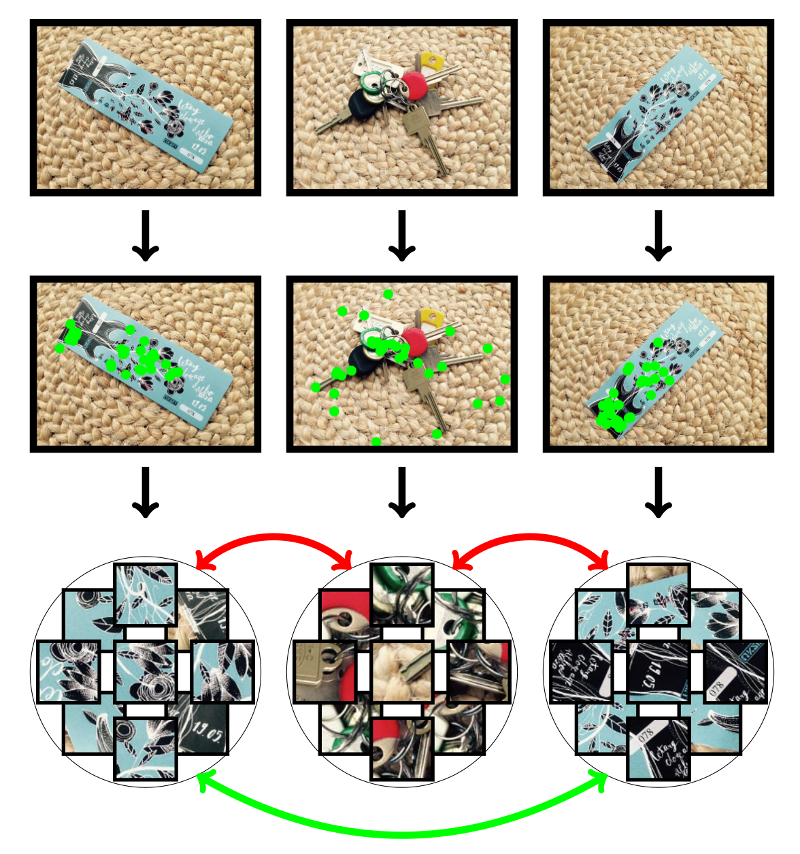

# Learning Local Descriptors from Weakly-Labeled Data

Current best local descriptors are learned on a large dataset of matching and non-matching keypoint pairs.
However, data of this kind is not always available since detailed keypoint correspondences can be hard to establish (e.g., for non-image data).
On the other hand, we can often obtain labels for pairs of keypoint bags.
For example, keypoint bags extracted from two images of the same object under different views form a matching pair, and keypoint bags extracted from images of different objects form a non-matching pair.
On average, matching pairs should contain more corresponding keypoints than non-matching pairs.
We propose to learn local descriptors from such information where local correspondences are not known in advance.

<center></center>

Each image in the dataset (first row) is processed with a keypoint detector (second row) and transformed into a bag of visual words (third row).
Some bags form matching pairs (green arrow) and some form non-matching pairs (red arrows).
On average, matching pairs should contain more corresponding local visual words than non-matching pairs.
We propose to *learn local descriptors* by optimizing the mentioned local correspondence criterion on a given dataset.
Note that prior work assumes local correspondences are known in advance.

The details of the method can be found in our technical report available on [arXiv](http://arxiv.org/abs/1603.09095).
If you use our results and/or ideas, please cite the report as (BibTeX)

```
@misc
{
	wlrn,
	author = {Nenad Marku\v{s} and Igor S. Pand\v{z}i\'c and J\"{o}rgen Ahlberg},
	title = {{Learning Local Descriptors by Optimizing the Keypoint-Correspondence Criterion}},
	year = {2016},
	eprint = {arXiv:1603.09095}
}
```

## Some results

A network trained with our method (code in this repo) can be obtained from the folder `models/`.
This network extracts `64f` descriptors of unit length from local patches of size `32x32`.
Here is its structure:

```
nn.Sequential {
  [input -> (1) -> (2) -> (3) -> (4) -> (5) -> output]
  (1): nn.MulConstant
  (2): nn.View
  (3): nn.Sequential {
    [input -> (1) -> (2) -> (3) -> (4) -> (5) -> (6) -> (7) -> (8) -> output]
    (1): nn.SpatialConvolution(3 -> 32, 3x3)
    (2): nn.ReLU
    (3): nn.SpatialConvolution(32 -> 64, 4x4, 2,2)
    (4): nn.ReLU
    (5): nn.SpatialConvolution(64 -> 128, 3x3)
    (6): nn.SpatialMaxPooling(2,2,2,2)
    (7): nn.SpatialConvolution(128 -> 32, 1x1)
    (8): nn.SpatialConvolution(32 -> 64, 6x6)
  }
  (4): nn.View
  (5): nn.Normalize(2)
}
```

The structure is specified in `models/3x32x32_to_64.lua`.
The net parameters are stored as a vector of floats at `models/3x32x32_to_64.params`.
This is to reduce the storage requirements (i.e., the repo size).
Use the following code to deploy and use the net.

```lua
-- load the network parameters first
params = torch.load('models/3x32x32_to_64.params')

-- create the network and initialize its weights with loaded data
n = dofile('models/3x32x32_to_64.lua')(params):float()

-- generate a random batch of five 32x32 patches (each pixel is a float from [0, 255])
p = torch.rand(5, 3, 32, 32):float():mul(255)

-- propagate the batch through the net to obtain descriptors
-- (note that no patch prepocessing is required (such as mean substraction))
d = n:forward(p)

-- an appropriate similarity between descriptors is, for example, a dot product ...
print(d[1]*d[2])

-- ... or you can use the Euclidean distance
print(torch.norm(d[1] - d[2]))
```

Notice that although it was trained on `32x32` patches, the model can be applied in a fully-convolutional manner to images of any size (the third module of the architecture contains only convolutions, ReLUs and pooling operations).

## How to repeat the training

Follow these steps.

#### 1. Prepare bags of keypoints

Download <https://nenadmarkus.com/data/ukb.tar> and extract the archive.
It contains two folders with JPG images: `ukb-trn/` and `ukb-val/`.
Images from the first folder will be used for training and images from the second one for checking the validation error.

Move to the folder `utils/` and compile `fast.cpp` and `extp.cpp` with the provided `makefile`.
These are the keypoint detection and patch extraction programs.
Use the script `batch_extract.sh` to transform the downloaded images into bags of keypoints:
```bash
bash batch_extract.sh ukb-trn/ ukb-trn-bags/ 128 32
bash batch_extract.sh ukb-val/ ukb-val-bags/ 128 32
```

Extracted patches should now be in `ukb-trn-bags/` and `ukb-val-bags/`.
As these are stored in the JPG format, you can inspect them with your favorite image viewer.

### 2. Prepare data-loading scripts

To keep a desirable level of abstraction and enable large-scale learning, this code requires the user to provide his/her routines for generating triplets.
An example can be found in `utils/tripletgen.lua`.
The strings "--TRN-FOLDER--", "--TRN-NCHANNELS--", "--TRN-PROBABILITY--", "--VLD-FOLDER--", "--VLD-NCHANNELS--" and "--VLD-PROBABILITY--" need to be replaced with appropriate ones.
The following shell commands will do this for you (replace each slash in the folder paths with backslash+slash as required by `sed`).
```bash
cp utils/tripletgen.lua tripletgen.lua
sed -i -e 's/--TRN-FOLDER--/"ukb-trn-bags"/g' tripletgen.lua
sed -i -e 's/--TRN-NCHANNELS--/3/g' tripletgen.lua
sed -i -e 's/--TRN-PROBABILITY--/0.33/g' tripletgen.lua
sed -i -e 's/--VLD-FOLDER--/"ukb-val-bags"/g' tripletgen.lua
sed -i -e 's/--VLD-NCHANNELS--/3/g' tripletgen.lua
sed -i -e 's/--VLD-PROBABILITY--/1.0/g' tripletgen.lua
```

After executing them, you should find the script `tripletgen.lua` next to `wlrn.lua`.

#### 3. Specify the descriptor-extractor structure

The model is specified with a Lua script which returns a function for constructing the descriptor extraction network.
See the default model in `models/3x32x32_to_64.lua` for an example.

You are encouraged to try different architectures as the default one does not perform very well in all settings
(this fact was experimentally discovered after the paper has already been published).
However, to learn their parameters, some parts of `wlrn.lua` might need additional tweaking, such as learning rates.

#### 4. Start the learning script

Finally, learn the parameters of the network by running the traininig script:

	th wlrn.lua models/3x32x32_to_64.lua tripletgen.lua -w params.t7

The training should finish in about a day on a GeForce GTX 970 with cuDNN.
The file `params.t7` contains the learned parameters of the descriptor extractor specified in `models/3x32x32_to_64.lua`.
Use the following code to deploy them:
```lua
n = dofile('models/3x32x32_to_64.lua')():float()
p = n:getParameters()
p:copy(torch.load('params.t7'))
torch.save('net.t7', n)
```

## License

MIT.

## Contact

For any additional information contact me at <nenad.markus@fer.hr>.

Copyright (c) 2016, Nenad Markus. All rights reserved.